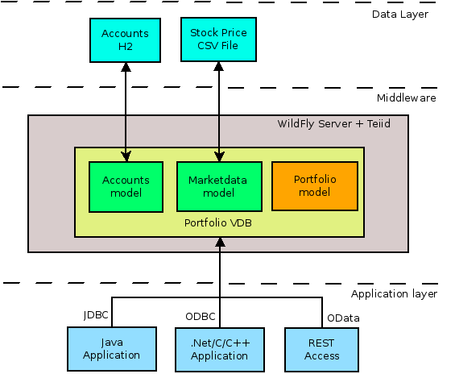

= Data Federation Example

|===
|Level |Technologies |Target Product |Product Versions |Source

|Basic
|Teiid, VDB, Native Queries, VDB reuse, reading data from JDBC, delimited file
|DV
|DV 6.0+
|https://github.com/teiid/teiid-quickstarts
|===

== What is it?

This quickstart demonstrates how to define a vdb to enable data federation across multiple data sources (i.e., relational and text file). This will demonstrate the following:

* how to federate data from a relational data source, a text file-based data source
* how to define a view using DDL
* how to define a translator override to support native queries

If you are not familiar with Teiid nomenclature please take few minutes to read basics http://teiid.jboss.org/basics/.

In this example we have a customer's account information in H2 database, say and he/she owns multiple stocks in their portfolio. In order to know the portfolio value, we need the current stock price to compute the account value. However, as we know stock price is always changing and depends on market. In this example, for simplicity, we choose that the stock prices are in a CSV file. In a slightly complicated example, you could even get this information from a web service that is provided through some brokerage firm. Given account information and stock prices we should be able to expose the account value to the user, while at the same time not exposing any details inner workings, nor writing any code

* Account Information, stored in a H2 database - link:src/teiidfiles/customer-schema.sql[customer-schema.sql]
* Market Data (Stock prices), stored in a CSV text file - link:src/teiidfiles/data/marketdata-price.txt[marketdata-price.txt], link:src/teiidfiles/data/marketdata-price1.txt[marketdata-price1.txt]

Using the above two sources, we will create a Virtual Database (VDB) in Teiid, that will give access to data in both these data sources. Once the VDB is built you can issue a SQL query spanning both these sources as if they are single source using Teiid. You also create VIEW/TABLE in the VDB, that can encompass the logic of integrating these sources into higher level domain model that exposes the account value. Note that none of these steps are copying the data from your original source(s), the data still resides in original sources unlike in ETL (extract, Transform and Load) tools. You can think of Teiid as Logical Data Warehouse without hassle of moving the data. After you are done building this VDB, you can then access this VDB just like any other database like Oracle, MS-SQLServer, MySQL etc. using JDBC and ODBC drivers. Note that for the client applications Teiid will look like any another relational database. They do not know anything about how, where, when the data is collected and supplied to the calling application. So effectively, it provides a Data Abstraction layer.

The deployment architecture of Teiid in this example can be summarized in below image

There multiple steps in building this example. We will call this as "Portfolio" VDB. Note that a VDB is nothing but a simple XML file with metadata about the sources you are trying to integrate together. The steps can be defined as

1. Configuring the connections to the data sources.
2. Creating the VDB file
3. Start the Teiid Server
4. Deploy the VDB file
5. Access the VDB using JDBC application. (ODBC is left as exercise to the user)

NOTE: this example provides the base setup for which other quick starts depend upon.

== Prerequisites

* link:../README.adoc#_downloading_and_installing_java[Java]
* link:../README.adoc#_downloading_and_installing_maven[Maven]
* link:../README.adoc#_downloading_and_installing_teiid[Teiid Server]
* link:../simpleclient/README.adoc[Simple Client]

== Setup

=== 1. Start the server

Refer to link:../categories/prerequisites.adoc#_start_the_server[Prerequisites] to start the Server.

=== 2. Copy teiid support files

Copy the "teiidfiles" directory to the $JBOSS_HOME/ directory. The src/teiidfiles directory should contain:

----
customer-schema.sql
customer-schema-drop.sql
data/marketdata-price.txt
data/marketdata-price1.txt
----

when complete, you should see $JBOSS_HOME/teiidfiles.

=== 3. Setup the h2 datasource and file resource adapter

Run the following CLI script

----
cd $JBOSS_HOME/bin
./jboss-cli.sh --connect --file={path}/vdb-datafederation/src/scripts/setup.cli
----

=== 4. VDB Deployment:

Copy (deploy) the Portfolio VDB related files to the $JBOSS_HOME/standalone/deployments directory

----
src/vdb/portfolio-vdb.xml
src/vdb/portfolio-vdb.xml.dodeploy
----

You should see the server log indicate the VDB is active with a message like: `TEIID40003 VDB Portfolio.1 is set to ACTIVE`. See <<Query Demonstrations, Query Demonstrations>> below to demonstrate data federation.

== Query Demonstrations

link:../simpleclient/README.adoc#_execution[Simple Java Client] for sample SQL Queries, link:../simpleclient/SQuirreL.adoc[SQuirreL Client] for a fully featured SQL Queries.

[source,sql]
.*Example - queries the relational source*
----
mvn exec:java -Dvdb="Portfolio" -Dsql="select * from product"
----

[source,sql]
.*Example - queries the text file-based source*
----
mvn exec:java -Dvdb="Portfolio" -Dsql="select stock.* from (call MarketData.getTextFiles('*.txt')) f, TEXTTABLE(f.file COLUMNS symbol string, price bigdecimal HEADER) stock"
----

[source,sql]
.*Example - queries the text file-based source view*
----
mvn exec:java -Dvdb="Portfolio" -Dsql="select * from StockPrices"
----

[source,sql]
.*Example - performs a join between the relational source and the text file-based source*
----
mvn exec:java -Dvdb="Portfolio" -Dsql="select product.symbol, stock.price, company_name from product, (call MarketData.getTextFiles('*.txt')) f, TEXTTABLE(f.file COLUMNS symbol string, price bigdecimal HEADER) stock where product.symbol=stock.symbol"
----

NOTE: The files returned from the getTextFiles procedure are passed to the TEXTTABLE table function (via the nested table correlated reference f.file). The TEXTTABLE function expects a text file with a HEADER containing entries for at least symbol and price columns.

[source,sql]
.*Example - queries the federated view*
----
mvn exec:java -Dvdb="Portfolio" -Dsql="select * from Stock"
----

[source,sql]
.*Example - native query*
----
mvn exec:java -Dvdb="Portfolio" -Dsql="select x.* FROM (call native('select Shares_Count, MONTHNAME(Purchase_Date) from Holdings')) w, ARRAYTABLE(w.tuple COLUMNS "Shares_Count" integer, "MonthPurchased" string ) AS x"
----

NOTE: Issue query that contains a NATIVE sql call that will be directly issued against the H2 database. This is useful if the function isn't supported by the translator (check the documentation for the types of translators that support NATIVE sql). Note that the translator override in the vdb xml enabling support for native queries has to be set.

[source,sql]
.*Example - SQL*
----
SELECT * FROM product
SELECT stock.* from (call MarketData.getTextFiles('*.txt')) f, TEXTTABLE(f.file COLUMNS symbol string, price bigdecimal HEADER) stock
SELECT * FROM StockPrices
SELECT product.symbol, stock.price, company_name from product, (call MarketData.getTextFiles('*.txt')) f, TEXTTABLE(f.file COLUMNS symbol string, price bigdecimal HEADER) stock where product.symbol=stock.symbol
SELECT * FROM Stock
SELECT x.* FROM (call native('select Shares_Count, MONTHNAME(Purchase_Date) from Holdings')) w, ARRAYTABLE(w.tuple COLUMNS "Shares_Count" integer, "MonthPurchased" string ) AS x
----
